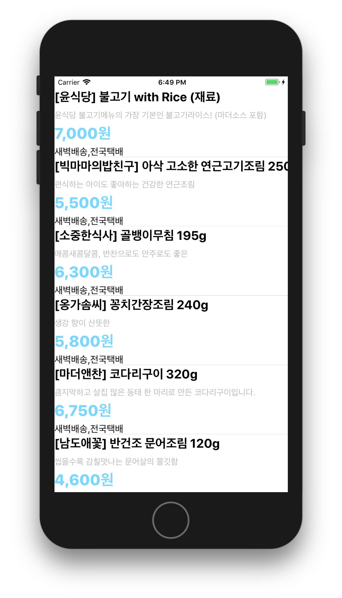

# 쇼핑앱

-

# 스텝 1. 상품 목록

### 요구사항

- 스토리보드 ViewController에 TableView를 추가하고 Safe 영역에 가득 채우도록 frame을 설정한다.
- 테이블뷰에 새로운 프로토타입 Cell을 추가하고, Custom 스타일로 지정하고 다음과 같이 디자인한다.

- JSON 파일을 받아서 JSONDecoder를 활용해서 내부에 Array<StoreItem> 타입으로 변환하는 DataSource에서 사용할 모델 객체를 만든다.
	* subscript로 배열에 index로 접근하면 StoreItem 구조체를 반환한다.
	* StoreItem은 Decodable 프로토콜을 채택하고, main.json에 있는 키와 값을 매핑해서 속성으로 갖도록 구현한다.
- UITableViewDataSource 프로토콜 구현 부분에서 cell을 위에서 만든 DataSource 모델 객체에 접근해서 테이블뷰를 표시한다.

### 작동화면

### 구현내용

- json 배열을 객채 배열로 구현
- 테이블뷰 내부에 커스텀 셀 구현
- 커스텀 셀 내부 이미지뷰 와 스택뷰 구성
	* 스택뷰 내부에 Label 구성
	* 스택뷰는 autoLayout 적용

-

# step 2. 오토레이아웃 적용

### 요구사항

 - 스토리보드 ViewController에 Cell을 Content View를 기준으로 하위 뷰들에 오토레이아웃을 적용한다.
	* 메뉴 이미지 뷰는 top, bottom, lead 제약을 주고 width 제약을 넣는다. 
	* height와 width 비율은 1:1로 aspectRatio를 맞춘다.
타이틀 제목은 메뉴 이미지보다 10pt 우측에 lead 제약을 주고, top, tail 제약을 주고, height 제약을 준다.
	* 상세 설명도 top 제약만 타이틀 제목보다 4pt 띄우고, 나머지는 타이틀에 맞춘다.
	* 메뉴 가격도 width 제약을 넣고, 나머지는 타이틀과 마찬가지로 제약을 준다.
	* 이벤트 배지는 최소width 제약만 주고 글자 내용에 맞추고, 없을 경우 감춘다.

### 작동화면

### 구현내용

- 이미지 constraints
	* leading,top,bottom spacing to superVeiw = 10 px
	* width 100
	* aspect 1:1

- label
	* label 을 스택뷰 내부에 구현
	* leading spacing to 이미 = 10
	* fill Equally
	* 스타일 설정 : 제목 두껍게, 설명 회색, 가격 파랑색 

	
-

# step 3. Custom Section 헤더 적용

### 요구사항

- 데이터를 추가하고 오토레이아웃을 적용한 상품목록 - 테이블뷰를 완성하는 것을 목표로 한다.
- 다음 2개 파일을 다운로드해서 프로젝트에 복사하고 JSONDecoder를 활용해서 모델 객체를 기존 main과 함께 섹션(section)을 구분할 수 있도록 개선한다.
- 스토리보드 ViewController에 Cell에 Section Header로 사용할 Custom Cell을 추가한다.

	* 총 섹션은 3개로 구분해서 헤더에 다음과 같이 표시한다.
	* main => 메인반찬 / 한그릇 뚝딱 메인 요리
	* soup => 국.찌게 / 김이 모락모락 국.찌게
	* side => 밑반찬 / 언제 먹어도 든든한 밑반찬

### 실행화면

### 구현방법

- 커스텀 헤더 추가 
	* xib 파일로 뷰와 레이블 구현
- 헤더 내용을 담는 헤더컨텐트매니저 추가
	* 헤더내용객체를 배열로 소유
- 데이터소스가 델리게이트 채택
	* 헤더컨텐트매니저에서 헤더내용 추출, 헤더로 전달

	
-
	
# step 4. 패키지 관리 CocoaPod

### 요구조건

- Cocoapod 를 설치한다. 
 - https://github.com/devxoul/Toaster 저장소에 있는 Toaster 패키지를 cocoapod 으로 설치한다.
 - pod으로 설치한 Toaster 모듈을 import 하고 테이블뷰 셀을 터치하면 (didSelect) 타이틀 메뉴와 (할인된)최종 가격 정보를 toast 형태로 표시한다.

 
### 작동화면

### 구현방법

- cocoapod 설치 
- cocoapod 를 통해서 Toaster 추가
- indexPath 를 받아서 storeItem 의 제목과 가격을 리턴하는 함수 추가
- 셀 선택시 이전에 있던 Toaster 삭제하고 새 Toaster 출력

-

# step 5 Network 프로그래밍

### 요구사항

- 아래 주소별로 JSON 데이터를 받아오는 모델 객체를 만든다.
	* HTTP 프로토콜 GET 요청으로 메인반찬, 국.찌게, 밑반찬 JSON 데이터를 받는다. 
- HTTP 요청은 URLSession 관련 프레임워크를 활용한다.
- 응답으로 받은 JSON 데이터를 마찬가지 방법으로 Decode해서 StoreItem 객체로 변환한다.
- 모델 객체는 응답이 도착하면 섹션별로 데이터를 바꾸고 각각 - Notification을 보내서 테이블뷰의 해당 섹션만 업데이트한다.

### 작동화면

### 구현내용